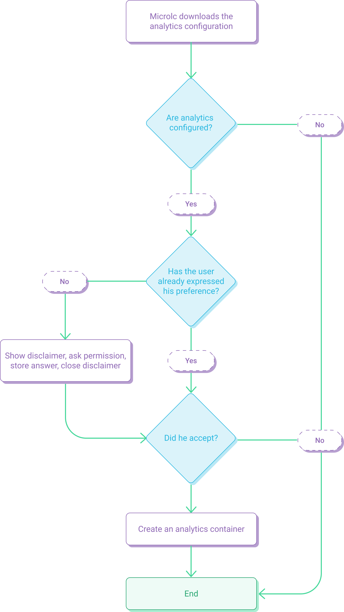

Analytics are available through [Google Analytics](https://analytics.google.com/), but **are not activated by default**.
If [analytics are configured](core_configuration.md#analytics), they are not enabled in the page until the user accept the
[cookie utilization disclaimer](core_configuration.md#disclaimer) for the first time.

The analytics authorization process can be summarized using the following schema:

:::info
The analytics authorization request is made only one time for each browser instance, 
because the answer is saved inside the browsers [`localStorage`](https://developer.mozilla.org/en/docs/Web/API/Window/localStorage).
:::
