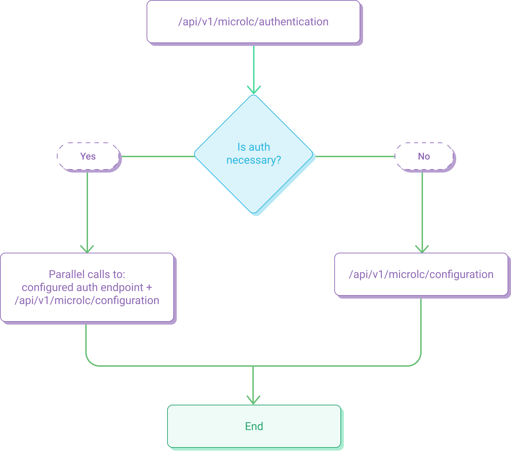

## Authentication configuration

The endpoint that exposes the authentication configuration is `/api/v1/microlc/authentication`.

### Configuration structure

The authentication configuration is a JSON object with two root properties which defines if the authentication process is expected
and where the user information are provided.

### isAuthNecessary

- *type*: boolean
- *required*: `false`
- *default*: `false`
- *description*: defines if the authentication process is expected.  
  This property can be used to avoid the authentication process, or to make a public instance of `micro-lc`.

### userInfoUrl

- *type*: string
- *required*: `false`
- *description*: defines which endpoint exposes the user information: it will be called using the `GET` method.  
  If authentication is not expected, this should not be provided. Otherwise, it is mandatory.

### userLogoutUrl

- *type*: string
- *required*: `false`
- *description*: defines the page that will handle the user logout.  
  If authentication is not expected, this should not be provided. Otherwise, it is mandatory.


### Example

```json
{
    "isAuthNecessary": true,
    "userInfoUrl": "https://example.com/your/authentication/api",
    "userLogoutUrl": "https://example.com/your/logout/page"
}
```

## User authentication

The authentication process is optional and completely configurable.
The [authentication](authentication.md#authentication-configuration) endpoint, that exposes the authentication configuration, is called first.

Then, the next endpoint to be called are different, depending on whether the authentication is required or not.

- If authentication is not required ([`isAuthNecessary = false`](authentication.md#isauthnecessary)), 
  then only the [configuration](core_configuration.md) endpoint is called.
- If authentication is required ([`isAuthNecessary = true`](authentication.md#isauthnecessary)),
  then the endpoint provided in the [userInfoUrl](authentication.md#userinfourl) is called,
  in parallel with the [configuration](core_configuration.md) endpoint.

The entire flow can be summarized with the following picture:




### User info response
To be valid for `micro-lc`, the [userInfoUrl](authentication.md#userinfourl) response must adhere to the following JSON schema:

```javascript
{
  type: 'object',
  properties: {
    avatar: {
      type: 'string',
    },
    email: {
      type: 'string',
    },
    groups: {
      type: 'array',
      items: {
        type: 'string',
      },
    },
    name: {
      type: 'string',
    },
    nickname: {
      type: 'string',
    },
  },
  required: ['email', 'groups', 'name'],
}
```

#### Example
```json
{
  "email": "mocked.user@mia-platform.eu",
  "groups": [
    "users",
    "admin"
  ],
  "name": "Mocked User",
  "nickname": "mocked.user",
  "avatar": "https://i2.wp.com/cdn.auth0.com/avatars/md.png?ssl=1"
}
```


## Plugin ACL

Each plugin can optionally adhere to an *ACL*,
that can be defined using the [`aclExpression`](core_configuration.md#aclexpression) configuration.

:::info
To evaluate, in the `aclExpression` is injected the `groups` object, take from the current user profiles (i.e. `groups.admin && groups.ceo`)
:::

The match between the `aclExpression` and the current user profiles is made by **be-config**.
**be-config** must receive the user profile in a header. Thanks to the environment variable `GROUPS_HEADER_KEY`, you can customize the names of the user profiles in **be-config** instance.

The only supported separator for the profiles injected in header is the comma `,` (i.e. `admin,developer,owner`).

From version `0.9.0`, in addition to user profiles it is possible evaluate in the `aclExpression` also the user permissions required to access a specific resource.
**be-config** must receive the user's permissions in stringified additional properties object in a header. Thanks to the environment variable `USER_PROPERTIES_HEADER_KEY`, you can customize the header used in **be-config** instance. Though, the property that contains the user's permissions string array must be `permissions` as shown in the following example:

```json
{"{{USER_PROPERTIES_HEADER_KEY}}":"{\"permissions\":[\"api.companies.view\",\"api.companies.create\"]}"}
```

:::info
From version `0.9.0`, in the `aclExpression` is injected the `permissions` object alongside the `groups` object, so it's possible to write them combining user profiles and permissions (i.e. `groups.admin && permissions.api.companies.create`)
:::

:::warning
`micro-lc` doesn't inject any header: they must be provided by external services.
:::
