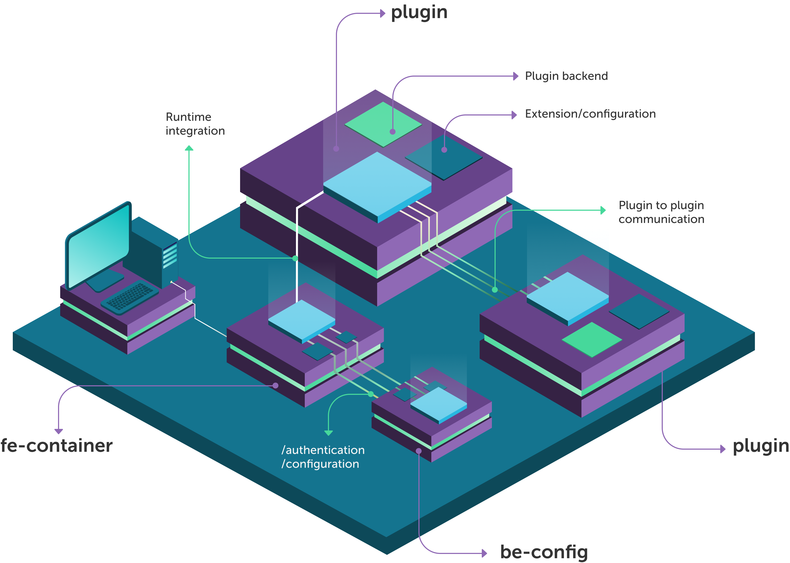

`micro-lc` is the open source solution for building flexible, multi-tenant frontend applications following the
[Micro Frontend](https://micro-frontends.org/) architecture.

`micro-lc` consists of a core interface that loads, embeds, and orchestrates **plugins** (your individual frontend
applications) at runtime, while providing configuration options and useful out-of-the-box features.

The project is open source, and it can be found on [GitHub](https://github.com/micro-lc/micro-lc). The
core components are written in Typescript and React, but `micro-lc` is **technology-agnostic**: this means that it integrates
seamlessly with your favorite toolkit, being it Angular, React, Vue, or anything else you like - even Vanilla JavaScript!

Take a look at the introduction about micro frontend and how `micro-lc` works:

## Architecture

`micro-lc` is composed by three main blocks: **fe-container**, **be-config** and a varying number
of **plugins**.

## Frontend container

The frontend core of `micro-lc` is the **fe-container**: a lightweight launcher written in `React` and `Typescript`. The **fe-container** 
has two main responsabilities: 

- to render the plugins;
- providing the application a set of core functionalities.

These functionalities are for the most part configurable through a [core configuration](core_configuration.md)
retrieved by the launcher at runtime. The choice of consuming this configuration at runtime makes the fe-container
**multi tenant**: multiple tenants can use the same instance of `micro-lc` controlling the rendered plugins and the
application theme through different configurations.

:::info
The **fe-container** is also available as [Docker image](https://hub.docker.com/r/miaplatform/microlc).
:::

Below there is a list of the features offered and handled by the **fe-container**.

### Base layout

The launcher provides the core navigation layout composed by a top bar and a side menu. The top bar is responsible for
the top-level functionalities. The list of plugins and the routing capabilities are placed by default on the side menu, 
but you can move them in the top bar.

While the top bar is always visible after the configuration load, the menu is designed as an overlay to leave as much space as possible to the
plugins.

:::tip
The plugins can implement their own sub-navigation with a dedicated side menu. Please note that the menu can be configured also on the topbar. 
This will not graphically or logically interfere with `micro-lc`, which will integrate seamlessly the plugin routing in the main one.
:::

### User management

`micro-lc` doesn't provide any authentication system, but it can be plugged in using the procedure described in the [Authentication section](authentication.md).

### Plugin management

One of the most important responsibilities of the **fe-container** is the management of the plugins.  
Each plugin is fetched and added to the side menu **at boot**, while it is rendered and embedded into the launcher **only when requested**.

:::note
If needed, a new route is registered at boot for accessing the plugin.
:::

All the information about the plugins to render are retrieved from the [Core configuration](core_configuration.md).

### Branding

Through the configuration, the **fe-container** handles the main branding of the application. Namely, it applies:

- the specified **[menu location](core_configuration.md#menulocation)** of the menu (topBar/sideBar);
- the specified **[logo](core_configuration.md#logo)** in the top bar;
- the specified **[favicon](core_configuration.md#favicon)** and **[document title](core_configuration.md#pagetitle)**;
- the specified **[navigation url](core_configuration.md#navigation_url)** to the logo;
- the specified **[primary color](core_configuration.md#primarycolor)** to the different layout components.

:::info
From the **primary color** is derived its **89% tint**, a mixture of the **primary color** with white: both are available using
the [`css variables`](https://developer.mozilla.org/en-US/docs/Web/CSS/Using_CSS_custom_properties),
respectively named `--microlc-primary-color` and `--microlc-primary-color-tint-89`.

`--microlc-primary-color-tint-89` is used to color, for example, the selected menu entry.
:::

### Dark mode

In `micro-lc` is available the **dark mode**, where the colors are changed to darker tints.
The dark mode is managed using the [`css variables`](https://developer.mozilla.org/en-US/docs/Web/CSS/Using_CSS_custom_properties)
mentioned above.
It is possible to configure a secondary icon link for the dark theme inside the field `url_dark_image` of the logo object.
In the `url_dark_image` field of the logo object you can configure the link to an alternative icon: this icon will be displayed when the dark mode is enabled.

:::info
A [qiankun plugin](plugin_configuration.md#qiankun-plugin) can programmatically check the `dark-theme` attribute,
on the `html` node, to know if dark mode is enabled.
:::

### Analytics

The integration with [Google Analytics](https://analytics.google.com/) is available and described in the [Analytics section](analytics.md).

## Backend configuration provider

The configuration consumed by the **fe-container** is served by **be-config**, detailed in its [dedicated section](backend.md).

## Plugins

The **plugins** are the `micro-fronted` that actually composes the end application.  
Each plugin is an **independent**, **self-contained** entity which can be written **in any framework**.
Plugins can have their own dedicated backend, and they can be extended or configured at will at runtime.

`micro-lc` offers different ways to integrate plugins, as outlined [in this section](plugin_configuration.md).  
Plugins can communicate with each other, or navigate to each other manipulating the history of the application:
see [Plugins communication](plugin_configuration.md#plugin-communication) section for a more detailed explanation.
